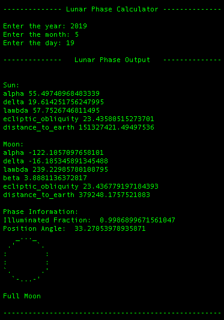

# Lunar Phase Calculator

This is an implementation of various algorithms from Jean Meeus' [Astronomical Algorithms](https://www.willbell.com/math/mc1.HTM). As a very cursory overview of our methods of calculating the phase the moon, we use the right ascension and declination of the Moon and the Sun from a geocentric perspective, and the distance to these celestial bodies from the Earth to calculate the percentage illumination of the moon and the position angle, given the year, month, and day (starting November 4712 BCE).

In order to gain more accuracy in terms of the time being used to calculate the phsae of the moon, enter the hours, minutes, seconds etc. as fractions to the day being entered. See use.py for sample usage.

## Requirements:
- Python3

## Usage:
- `python3 use.py`
- Read lunar_phase_library.py for a better understanding of how to use the various algorithms that we have implemented from Astronomical Algorithms.

## Examples:

")